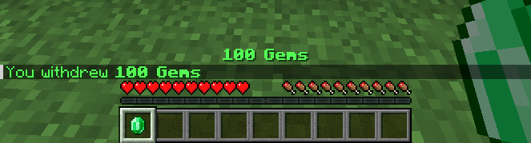
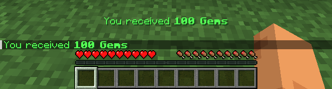
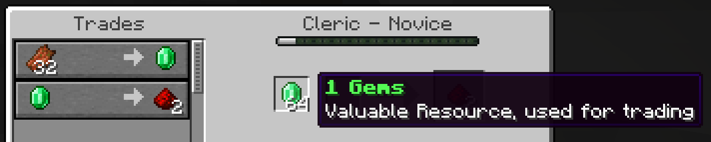

# Gems

[](https://github.com/EgorKhabarov/Gems/actions/workflows/build.yml)

**Gems** is a lightweight plugin for **Minecraft Paper servers** that lets players store and manage their in-game currency inside **emerald items**.  
It also adds **currency drops on player death**, making the economy more immersive.

## Features

- Store any amount of currency inside emeralds
- Withdraw currency as physical items
- Deposit emeralds back into your balance
- Receive currency loot when players die
- Fully configurable via `config.yml`

## Permissions

- `gems.give` - Allows using the admin command `/gems give` to give currency items to players
- `gems.reload` - Allows reloading the plugin configuration via `/gems reload`
- `gems.withdrawal` - Allows using `/gems withdrawal` to withdraw currency as emeralds

## Quick start

Use `/gems withdrawal <value> [count]`
<details><summary>Parameter notation</summary>

- `<...>` - required parameter
- `[...]` - optional parameter
</details>

- `value` - the amount of currency per emerald
- `count` - number of emeralds to withdraw *(optional, default: 1, max: 64)*

### Examples

- `/gems withdrawal 100 64` - gives 64 emeralds worth **100 currency** each  
- `/gems withdrawal 100` - gives **1 emerald** worth **100 currency**



## Depositing Currency

To convert a currency emerald back into balance:
1. Hold the emerald in your **main hand**
2. **Left-click** or **right-click** on any block or in the air
3. The stack of emeralds will disappear, and its value will be added to your balance




## Villager Trading Compatibility

You can withdraw low-value emeralds for villager trades:
```
/gems withdrawal 1 64
```
This command gives 64 emeralds worth **1 currency** each - perfect for trading!


